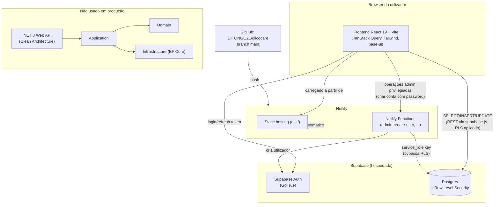

# Arquitetura

## Visão geral (produção)

Em produção, o GlicoCare é uma SPA React que fala diretamente com o Supabase (Postgres +
Auth) através do SDK JS, protegida por Row Level Security (RLS) ao nível da base de
dados. Não existe uma API própria entre o browser e a base de dados para as operações
normais — a única exceção são operações administrativas privilegiadas (criar
médicos/utentes com password), que passam por uma Netlify Function porque exigem a
`service_role key` do Supabase, que nunca pode ser exposta no browser.

## Nota importante: backend .NET

A pasta `backend/` contém uma API ASP.NET Core construída em Clean Architecture
(Domain / Application / Infrastructure / API), com entidades, casos de uso e um
`DbContext` próprio. Foi desenvolvida como peça de arquitetura para demonstrar
conhecimentos de padrões de backend (separação de camadas, injeção de dependências,
DTOs, autenticação JWT) no âmbito da PAP.

**Esta API não está em produção.** Desde a Fase 3, o frontend deixou de a chamar e passou
a comunicar diretamente com o Supabase. O backend .NET está congelado — não é tocado, não
corre no Netlify, e o `netlify.toml` não o referencia. Fica no repositório como
demonstração de arquitetura em camadas e não como parte do sistema em execução.

## Porque Supabase em vez de manter a API .NET

- **Menos infraestrutura**: sem servidor próprio para manter/pagar; Postgres, Auth e
  hosting de ficheiros ficam geridos pelo Supabase.
- **RLS como camada de autorização**: as políticas em `002_rls_policies.sql` garantem
  que um médico só vê os utentes que lhe estão associados, que um utente só vê os seus
  próprios dados, e que o admin nunca acede a mensagens privadas nem notas clínicas —
  tudo isto aplicado pela própria base de dados, não pelo código da aplicação.
- **Deploy mais simples**: o frontend é 100% estático (Netlify), o que reduz custo e
  complexidade de deploy face a manter um backend .NET sempre ativo.

## Fluxo de deploy

1. Push/merge para `main` no GitHub (`DITONGO21/glicocare`, privado).
2. A Netlify deteta o push e corre `npm run build` dentro de `frontend/` (definido em
   `netlify.toml`, `base = "frontend"`).
3. O resultado (`frontend/dist`) é publicado como site estático em
   `https://glicocare.netlify.app`.
4. As Netlify Functions em `frontend/netlify/functions` são publicadas como funções
   serverless, acessíveis em `/.netlify/functions/<nome>`.
