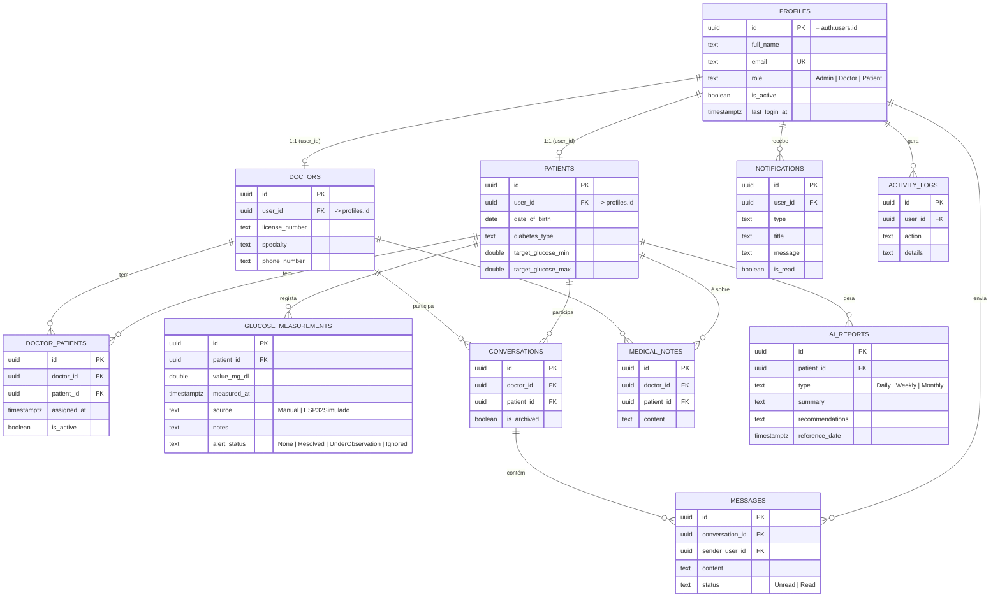

# Base de Dados

Postgres (Supabase). Schema completo em `database/supabase/001_schema.sql`, políticas de
Row Level Security em `database/supabase/002_rls_policies.sql`, dados de demonstração em
`database/supabase/seed.mjs`.

## Diagrama entidade-relação

## Tabelas

- **profiles** — espelha `auth.users` 1:1 (o `id` é o mesmo). Guarda nome, email, `role`
  (Admin/Doctor/Patient) e estado da conta.
- **doctors** / **patients** — dados de perfil específicos de cada papel, ligados a
  `profiles` por `user_id`.
- **doctor_patients** — associação muitos-para-muitos entre médicos e utentes; é o admin
  quem cria/gere estas associações.
- **glucose_measurements** — cada leitura de glicemia de um utente: valor, momento,
  origem (`Manual` ou `ESP32Simulado`), notas e `alert_status` calculado
  automaticamente com base no intervalo-alvo do utente.
- **conversations** / **messages** — mensagens diretas entre um médico e um utente
  associados; uma conversa por par médico-utente.
- **medical_notes** — notas clínicas privadas, escritas por um médico sobre um utente.
- **ai_reports** — resultado da "análise inteligente" (simulação baseada em regras, não
  um modelo de ML real) por período (diário/semanal/mensal).
- **notifications** — notificações in-app por utilizador.
- **activity_logs** — registo de auditoria simples por utilizador.

Todas as tabelas têm `created_at`/`updated_at` (com trigger automático) e `deleted_at`
para soft-delete.

## Políticas de RLS mais importantes

RLS está ativo em todas as tabelas. Regras centrais (ver `002_rls_policies.sql` para o
detalhe completo):

- **O admin nunca vê mensagens nem notas clínicas.** Não existe nenhuma policy de
  `select`/`all` para Admin em `conversations`, `messages` ou `medical_notes` — só
  médico (participante/autor) e utente (participante, apenas mensagens) têm acesso.
  Isto é uma regra de negócio explícita da especificação: dados clínicos/privados ficam
  fora do alcance da administração.
- **O admin também não vê `glucose_measurements`.** Só o próprio utente e o(s) médico(s)
  associados a ele têm acesso — o admin gere contas e associações, não dados clínicos.
- **Um médico só vê os utentes que lhe estão associados** (via `doctor_patients` com
  `is_active = true`), tanto para `patients`, `profiles`, medições, mensagens e notas.
- **Um médico só pode alterar o `alert_status` de uma medição**, nunca o valor ou as
  notas — a policy de update permite a linha, mas a aplicação só envia `alert_status` no
  pedido (a restrição de coluna é reforçada na camada de aplicação, não apenas na BD).
- **Um utente só acede aos seus próprios dados** (medições, perfil, conversas onde é
  participante).
- **`activity_logs`**: o admin vê tudo (auditoria); cada utilizador só vê o seu próprio
  registo.
